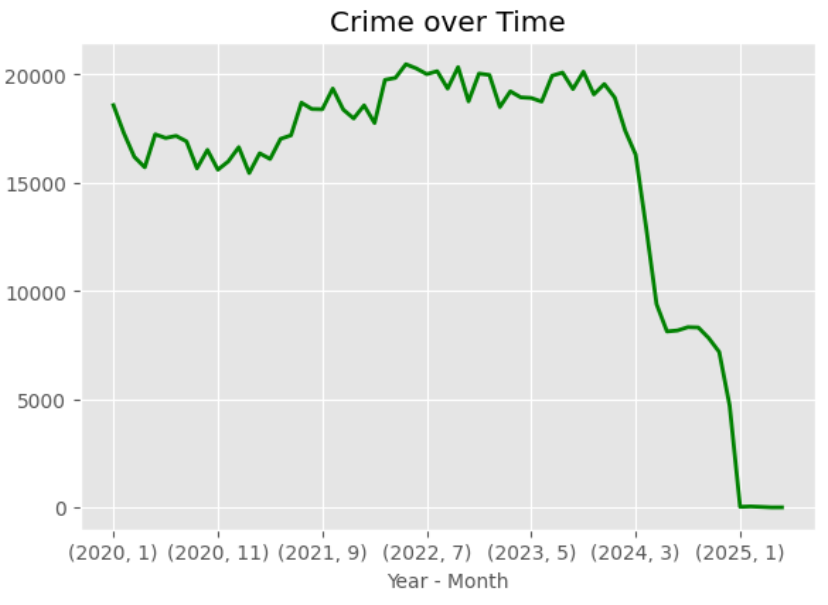
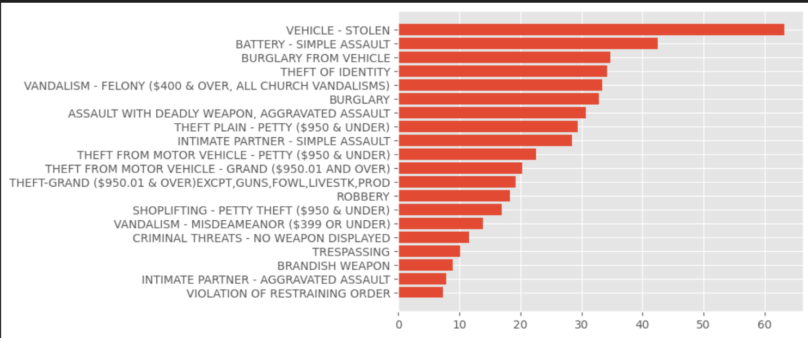
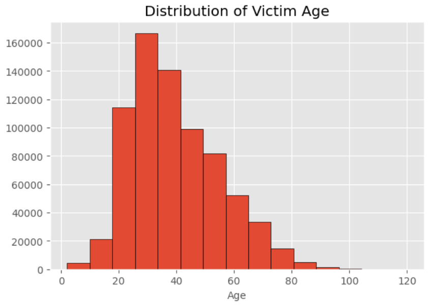

# L.A. Crime Analysis Project 2020 - 2025

## Overview
This project examines crime data in Los Angeles from 2020 to 2025, aiming to identify patterns and insights related to crime reporting times, victim demographics, and areas most affected by crime. Through a systematic approach, the project explores and visualizes key aspects of crime trends across the city.

## Getting the Data Set
The data set used in this project was retrieved from public sources providing detailed records of crime incidents in Los Angeles. The data file (in CSV format) should be downloaded and placed in the designated project directory for use.

## Importing the Data into Python/Jupyter Notebooks
1. Open Jupyter Notebook (or your preferred Python environment).
2. Import required libraries and read the CSV data as follows:

   ```python
   import pandas as pd
   crime = pd.read_csv('Crime_Data_from_2020_to_Present_20250630.csv')

Understanding and Preparing the Data
Inspected the dataset for missing or inconsistent entries.

Cleaned data by removing duplicates and handling null values where needed.

Converted columns related to dates and times into datetime objects to facilitate time-based analysis.

Performed exploratory data analysis (EDA) to gain familiarity with the data structure and initial trends.

Understanding & Analysis
Insights Discovered:
Time taken to report the crime:
Assessed the gap between when a crime occurred and when it was reported, identifying reporting delays.

Average victim age per crime:
Grouped crimes by type to calculate and analyze the mean victim age for different categories.

Areas with the most crime:
Mapped crime incidents to neighborhoods to highlight locations with the highest concentration of cases.

Results
The analysis revealed significant patterns in reporting delays, variations in victim age by crime category, and identified neighborhoods with the highest crime rates. These findings offer valuable perspectives for city officials, policy makers, and the general public.

Requirements
Python 3.7 or later

pandas

numpy

Jupyter Notebook

Running the Analysis
Download the dataset and save it to the project folder.

Launch Jupyter Notebook and open the provided notebook file.

Run each cell sequentially to perform the analysis and review the results.

> **Note:**  
> The data file `Crime_Data_from_2020_to_Present_20250630.csv` exceeds GitHub's upload limit and is not included in this repository.  
> To use this project, please download the dataset from the [LA Open Data Portal](https://data.lacity.org/) and save it in your project folder with the same filename.


## 📊 Sample Output

### Crime Over Time


### Top 20 Crimes


### Distribution of Victim Age



---

## Connect with Me

- [GitHub](https://github.com/Sophos333)
- [LinkedIn](https://www.linkedin.com/in/yashuasspear-oscar-holguin-silva/)
- [Portfolio](https://sophos333.github.io/sophos-chatbot-portfolio/)

---
